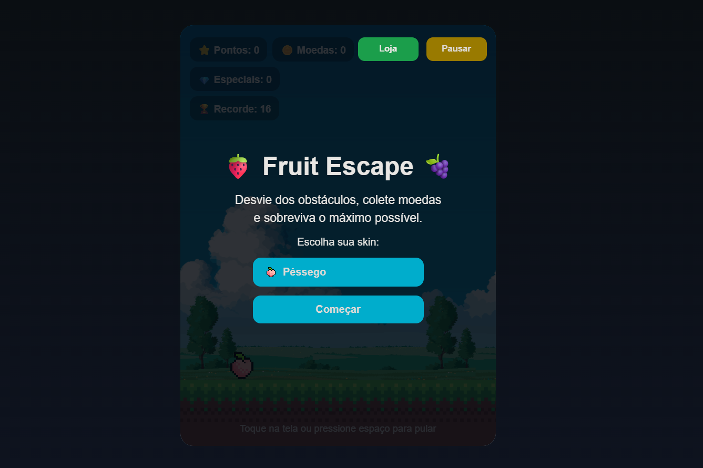
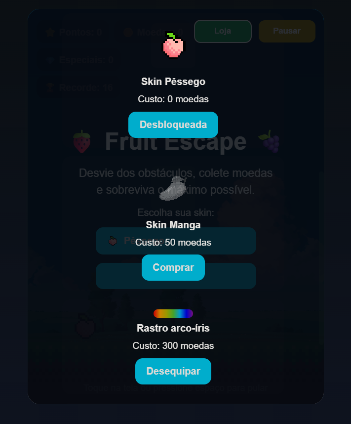

# 🍓 Fruit Escape

Fruit Escape é um jogo 2D para navegador desenvolvido com **HTML**, **CSS** e **JavaScript**, com foco em prática de lógica de programação, física simples, responsividade e sistemas interativos.

No jogo, o jogador precisa desviar de obstáculos, usar plataformas, coletar moedas e itens especiais, além de desbloquear skins, melhorias e cosméticos na loja.

---

## 🎮 Demonstração

> Coloque aqui o link do jogo publicado  
> Exemplo: `https://seuusuario.github.io/fruit-escape/`

---

## 📸 Imagens do projeto

Coloque aqui screenshots do jogo:

- Tela inicial 
 
- Loja 
 


Exemplo:

```md


